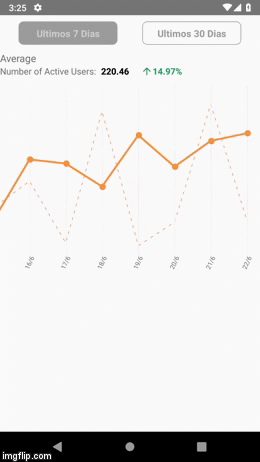

# AnotherViewGraph

Build of a simple graph using react-native with d3 library.

To run this you need install npm: https://www.npmjs.com/

npm install react-redux --save
npm install react-native-swipe-gestures --save
npm install d3 --save
npm install d3-scale --save
npm install d3-shape --save
npm install ART --save
npm install react-native-elements --save
npm install react-native-vector-icons --save
npm link
react-native run-android||run-ios
react-native start

